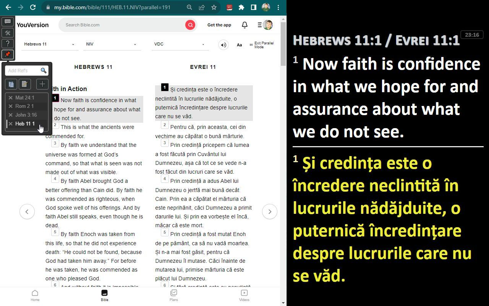
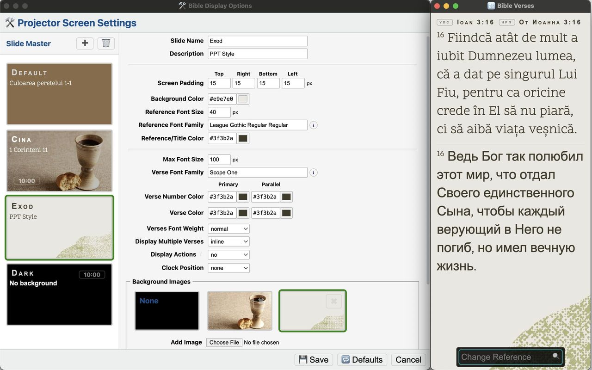

# Chrome extension to for Bible.com

This extension will help you **project Bible verses in your Church**,
You decide which version to display and also can project parallel versions
or in **2 different languages**.

## ⚙ Install Plugin

- [x] ✔ Install Chrome plugin from **Chrome web store** [Project verses from bible.com](https://chrome.google.com/webstore/detail/project-verses-from-bible/fklnkmnlobkpoiifnbnemdpamheoanpj)
- [x] visit https://bible.com/bible
- [x] new actions (💬, 🛠, ❔, 📌) should be visible in top/left corner
- [ ] 📌 **Pin** extension to see it after search bar for fast access
  - [ ]  Click on **Extension** icon

## Table of Contents

<!-- START doctoc generated TOC please keep comment here to allow auto update -->
<!-- DON'T EDIT THIS SECTION, INSTEAD RE-RUN doctoc TO UPDATE -->

- [⚙ Install Plugin](#-install-plugin)
- [💠 Features & Usage](#-features--usage)
- [📈 Release Notes](#-release-notes)
- [🎞 Results](#-results)
- [🎫 QR Code](#-qr-code)
- [👋 Support my Work](#-support-my-work)
- [💠 Advanced Features](#-advanced-features)
- [⚙ Setup Plugin as Developer](#-setup-plugin-as-developer)
- [▶ Build procedure](#-build-procedure)
- [📋 Developers TODOs (items to improve)](#-developers-todos-items-to-improve)

<!-- END doctoc generated TOC please keep comment here to allow auto update -->

## 💠 Features & Usage

- [x] 🔤 **Project selected verses** (+/- parallel text)
  - [x] 🔎 `Search` Book and Chapter
  - [x] `Click` on verse number to **display** it on projector
  - [x] `Up / Down / Left / Right` arrows to navigate to **next/preview** verses
  - [x] `CTRL + Click` to **add verse** to selection (multi select)
  - [x] `Shift + Click` to multi select between last selection
  - [x] `ALT + Click` on verse number or Pinned reference, to force project window to be on top (in case is not visible)
  - [x] `ESC` to show **blank page** (hide all selected verses)
  - [x] `F11` to enter/exit **fullscreen** projector window (first focus it)
- [x] 💬 **Project "live text"** (fast and simple slide)
  - [x] input any text to be projected ([Markdown](https://github.com/markedjs/marked) format)
  - [x] `CTRL + Enter` to project live text (inside title or textarea)
  - [ ] Select any text from page and allow it to be projected
- [x] 📌 **List/Pin some references** (verses)
  - [x] Store references for future selection and project them faster
  - [x] `Enter` to add references (`,` or `;` as separator) in **Pin verses 🔍** input
  - [x] `Enter + Enter` to project added reference
  - [x] `Shift + Enter` to add and project full reference (Mat 6:7-13)
  - [x] `ALT + Click` on Reference - force project (on top)
  - [x] `CTRL + Click` project all verses from pin (Mat 6:7-13)
  - [x] 📝 **Edit All** to Copy/Paste/Edit multiple references
  - [x] ➕ will pin current Reference if search input is empty
  - [x] 'Search pin': `16`, `2-4`, `2:4`, `2 4`, `+Enter` - pin current chapter or verses
  - [x] ↕ **drag & drop** to reorder verses
  - [x] 🖱 **Context menu** (right click) for more actions inside pin list
    - [x] 📄 **Copy** selected verse to clipboard
    - [x] 📄 **Copy** all pin verses to clipboard
    - [x] ✖ Clear all
  - [x] **Change Reference 🔍** from Projector tab - works same as **Add Ref's 🔍**
    - [x] `Tab` inside projector tab to see bottom dock-bar
    - [x] 🖱 move mouse at the bottom edge of projector tab
    - [x] Type any reference and use same shortcuts to project it (`Enter` or `Shift + Enter` for multiple verses)
- [x] 2️⃣ open **Multiple chrome tabs** with different chapters
  - [x] all windows will project to the same projector page
  - [x] projector page will close only when all tabs from bible.com are closed
- [x] 🛠 **User Settings** (top-left actions)
  - [x] Toggle 1️⃣ primary OR 2️⃣ parallel verses to be projected
  - [x] Adjust css variables (spacing, colors)
  - [x] remember last windows position (projector & settings)
  - [x] ☽ Try [Night mode](https://github.com/JosNun/night-mode-bible) extension

## 📈 Release Notes

Check [release-notes.md](release-notes.md) changelog

💚 Love this extension? Share [feedback](https://chromewebstore.google.com/detail/project-verses-from-bible/fklnkmnlobkpoiifnbnemdpamheoanpj) and help us make it even better!

## 🎞 Results

**1️⃣ Primary** View + projected

**2️⃣ Parallel** View + projected

**💬 Actions**

**🛠 Settings**

## 🎫 QR Code

[bit.ly/project-bible](https://bit.ly/project-bible)

## 👋 Support my Work

A simple way to **support my work** & to **improve** your programming skills is to buy **My course on Udemy**.
(Or you can **Gift this course** to someone that will benefit from it).

- [x] ‍💻 [Become a WEB Developer from Scratch, step by step Guide](https://nmatei.github.io/web) - by [Nicolae Matei](https://nmatei.github.io/)

## 💠 Advanced Features

- [x] **Slide master** - allow **Multiple layouts** (easy switch between them)
  - [x] 🕒 **Clock** position (or hide)
  - [x] Upload multiple **background images** and allow to easy switch them
  - [x] Background Opacity (make image lighter or darker)

## ⚙ Setup Plugin as Developer

If you want to try the latest versions before they are released, or to change code as you wish, try to install it as Developer

- [x] **Download/Clone** this repo
  - [ ] as zip & Unzip it
  - [x] or `git clone https://github.com/nmatei/chrome-bible-utilities.git`
  - [x] to update use `git pull`
- [x] Open [chrome://extensions/](chrome://extensions/)
  - [x] Activate `Developer mode`
- [x] **Load unpacked** Extension
- [x] Select `chrome-bible-utilities` folder

## ▶ Build procedure

- make sure all files are commited and pushed
- `npm install`
- `npm run deploy`
- under /build folder you will find latest zip file
- upload it to [chrome web store](https://chrome.google.com/webstore/developer/dashboard)

## 📋 Developers TODOs (items to improve)

- [ ] Multi slides to project content (same as live text but with multiple slides)
  - [ ] Add/Edit/Remove slides
- [ ] Check if verses are not in sync
  - [x] Available Language mappings and version
    - [x] Russian (НРП/СИНОД/SYNO/CARS/CARS-A)
    - [x] Ukrainian (UBIO)
  - [ ] Review Translations and create other [mappings](views/common/bible-mappings.js)
    - [ ] Especially for 🟨🟦 Ukrainian & ⬜🟦🟥 Russian
    - [x] 🙏 [mappings tests](test/bible-mappings.test.ts)
    - [x] 🙏 need some external help here (if you find issues please create a [tiket](../../issues) with link you've seen)
- [ ] 🛠 **User Settings**
  - [ ] Allow different design (slide master) on each window
  - [ ] Allow to easy select font family from drop down (or add your own)
  - [ ] Add config for body / verses text shadow.
  - [ ] Allow display inline/block for main screen
  - [ ] Empty Text display (ex. Church name, verse, motto, etc.)
    - [ ] Customize size & color
- [ ] Add WebHooks configs (ex. to publish to wireless monitors)
  - [ ] create integration app that can be installed
- [ ] i18n
- [ ] cleanup chars when add ref from copy/paste
  - [ ] ‭‭Filipeni‬
- [ ] use TypeScript and a build system?
  - [ ] https://medium.com/@tharshita13/creating-a-chrome-extension-with-react-a-step-by-step-guide-47fe9bab24a1

### 🐛 Known bugs

- [x] https://www.bible.com/bible/191/EXO.15.VDC (v.2 - custom background color in dark mode - text not fully visible)
- [x] Select verse from parallel view then press right/left arrows - will not project the correct format
