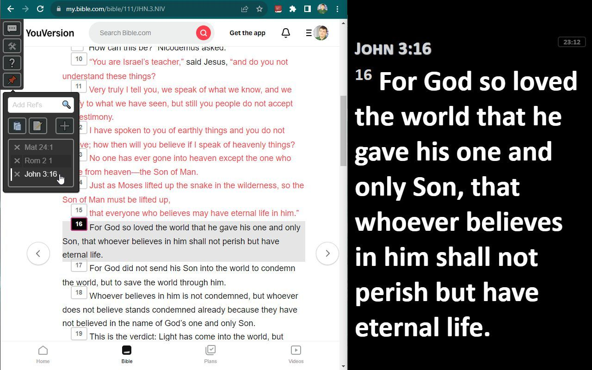
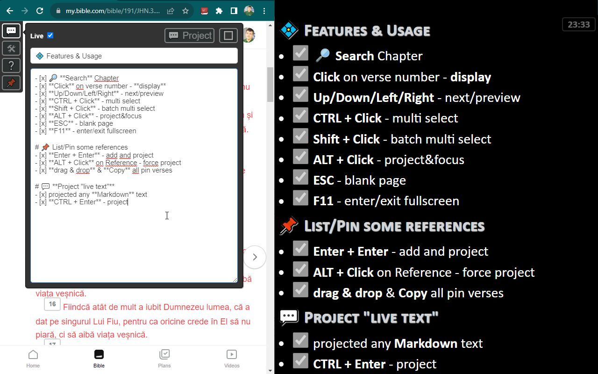

# Chrome extension to for Bible.com

This extension will help you **project Bible verses in your Church**,
You decide which version to display and also can project parallel versions
or in **2 different languages**.

## 💠 Features

- [x] **Project** selected verses (+/- parallel text)
  - [x] `Search` Book and Chapter
  - [x] `Click` on verse number to display it on projector
  - [x] `Up/Down/Left/Right` arrows to navigate to next/preview verses
  - [x] `CTRL + Click` to add verse to selection (multi select)
  - [x] `ALT + Click` to force project window to be on top (in case is not visible)
  - [x] `ESC` to show blank page (hide all selected verses)
  - [x] `F11` to enter/exit fullscreen projector window (first focus it)
- [x] 🛠 User Settings (top-left actions)
  - [x] Adjust css variables (padding, colors)
  - [x] remember last windows position (projector & settings)
- [x] 💬 Project "live text"
  - [x] input any text to be projected
  - [ ] Select any text from page and allow it to be projected
- [x] improved text for copy (hide notes and add space after verse number)

## Results

Primary View + projected

Parallel View + projected

Actions

## ⚙ Setup Plugin as Developer (one time only)

- [x] **Download/Clone** this repo
  - [ ] as zip & Unzip it
  - [x] or `git clone https://github.com/nmatei/chrome-bible-utilities.git`
  - [x] to update use `git pull`
- [x] Open [chrome://extensions/](chrome://extensions/)
  - [x] Activate `Developer mode`
- [x] **Load unpacked** Extension
- [x] Select chrome-bible-utilities folder
- [x] 📌 **Pin** extension to see it after search bar for fast access
  - [x]  Click on **Extension** icon
  - [x] Will open https://my.bible.com/bible if not opened
- [x] Sign in to YouVersion on https://my.bible.com/sign-in
  - [x] Must be logged in to have parallel view and to enable this plugin

## Developers TODOs (items to improve)

- [ ] Improve search
  - [ ] Type full verse reference (+shorcuts: Rom 2.2) and press enter to display it automatically
- [ ] Check if verses are not in sync 
  - [x] Numbers 13 in RO vs RU has more verses
  - [x] Chapters in Psalms in RO vs RU have different numbers
- [ ] Sync primary verses to be in same 'line' with parallel
  - [ ] If parallel/primary is selected (focused) - second view primary/parallel should scroll
- [ ] User Settings
  - [ ] Select what verses to display on main screen
  - [ ] Allow to display on 2 different screens (more than 2 even better)
  - [ ] Allow display inline/block for main screen or projected screen
  - [ ] Adjust font-size & line-height for main page
  - [ ] Remember last url (or if parallel was opened - store it in storage.sync)
  - [ ] Display Reference version (VDC, НРП)
  - [ ] Customize styles for parallel vs primary
  - [ ] Empty Text display (ex. Church name, verse, motto, etc.)
    - [ ] Customize size & color
  - [ ] Add host_permissions/matches https://bible.com/bible* https://www.bible.com/bible*
    - [ ] to be able to use it even not logged in